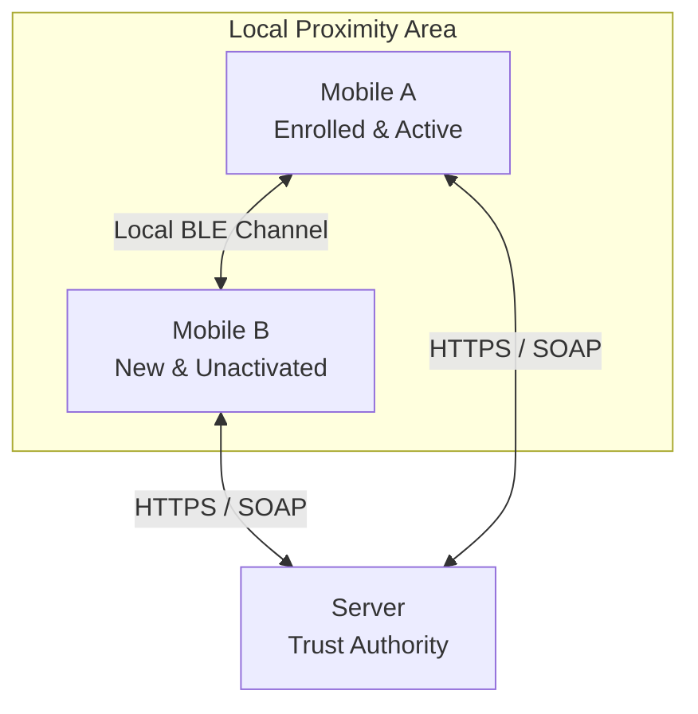
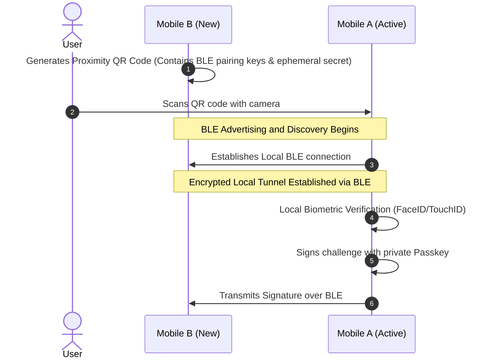
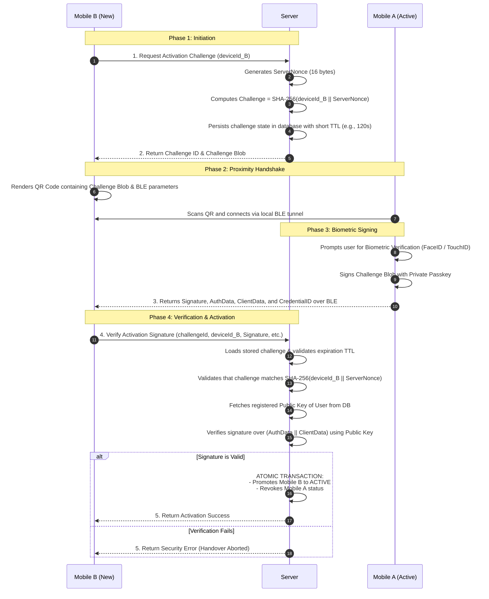

# Proximity-Based Passkey Device Activation Protocol

This document describes the architectural, logical, and functional design of the secure device activation protocol. It enables an existing, enrolled device (**Mobile A**) to securely authorize and activate a new device (**Mobile B**) through the central application server (**Server**). 

By leveraging native **WebAuthn/Passkey Hybrid Flows**, this protocol provides a seamless user experience while guaranteeing absolute cryptographic security and physical proximity during the transfer of trust.

---

## 1. Architectural Roles

The protocol defines three core actors, abstracting away any specific backend infrastructure or proprietary components:

1. **The Server**:
   * Acts as the central trust authority and identity provider.
   * Manages user records, registered public keys, and device activation states.
   * Generates cryptographically secure, short-lived challenges.
   * Verifies the authenticity of registration and activation signatures.
   * Performs atomic state transitions (e.g., activating Mobile B and revoking Mobile A).

2. **Mobile A (The Active Device)**:
   * The user's currently registered, fully active device.
   * Securely stores the private key of the Passkey inside its hardware-backed enclave (e.g., Secure Enclave).
   * Authorized to sign challenges requested by the Server.

3. **Mobile B (The New Device)**:
   * The new device seeking activation.
   * Triggers the activation sequence and submits the proximity signature to the Server to finalize its enrollment.

---

## 2. The Core Security Guarantee: Enforced Physical Proximity

Traditional multi-factor authentication (MFA) mechanisms—such as SMS OTP, email links, or authenticator app codes—are vulnerable to **remote phishing** and **social engineering** attacks. An attacker located on the other side of the world can trick a user into disclosing a code and gain control of their account.

This protocol completely neutralizes remote attacks by utilizing the **WebAuthn Hybrid (Cross-Device) Flow**, which guarantees **Physical Proximity** through a dual-channel handshake:

### How Proximity is Cryptographically Enforced

1. **Visual Out-of-Band Key Exchange (QR Code)**:
   Mobile B generates and displays a high-entropy, short-lived QR code on its screen. This QR contains cryptographic pairing parameters and a session-specific routing key.
2. **Local Wireless Discovery (Bluetooth Low Energy - BLE)**:
   When Mobile A scans the QR code, it initializes its local Bluetooth radio. The two devices discover each other and perform an encrypted handshake over BLE.
3. **Physical Range Limitation**:
   By relying on **Bluetooth Low Energy (BLE)**, the protocol enforces a strict physical range limitation (typically under 10 meters). The handshake **cannot** succeed over the internet, over a Zoom call, or across separate rooms. Even if a remote attacker tricks a user into scanning a QR code displayed on a phishing site, the BLE connection will fail due to distance, immediately aborting the attack.
4. **Hardware-Bound Biometric Consent**:
   The signature is only created after the user provides active consent via a biometric prompt (FaceID, TouchID, or passcode) on Mobile A. This ensures that the physical device is in the active possession of the legitimate user.

---

## 3. Logical Sequence Flow

The logical workflow consists of four major phases, starting from Mobile B requesting a challenge, to the Server atomically transitioning the active device status.

---

## 4. Key Security Controls & Benefits

This architecture implements several robust security controls designed to prevent common banking and security attack vectors:

| Attack Vector | Security Control | Technical Mechanism |
| :--- | :--- | :--- |
| **Man-in-the-Middle (MitM)** | **Relying Party ID (RP ID) Binding** | The client device checks that the server's RP ID matches the domain of the active web credentials. Phishing domains cannot fake this domain matching. |
| **Replay Attacks** | **Short-Lived Cryptographic Nonces** | The Server generates a unique `ServerNonce` for each request. The challenge has a strict Time-To-Live (TTL) of 120 seconds in the database, after which it becomes permanently unusable. |
| **Device Spoofing** | **Dynamic Payload Binding** | The challenge is dynamically bound to Mobile B's unique hardware identifier: `Challenge = SHA-256(deviceId_B \|\| ServerNonce)`. This prevents an attacker from intercepts-and-reusing a signature generated for one device to activate a different device. |
| **Remote Credential Theft** | **No Shared Secrets** | No passwords, private keys, or PINs are ever transmitted over the network or local BLE. The private key remains locked in the Secure Enclave, and only single-use signatures are exported. |
| **Simultaneous Active Devices** | **Atomic DB Promotion** | The promotion of Mobile B and the revocation of Mobile A are executed in a single atomic database transaction. There is zero opportunity window where both devices can be active concurrently. |

---

## 5. Summary of Strategic Value

By transitioning from legacy code-based activation to this proximity-based Passkey model, the application achieves:
* **Zero Phishing Liability**: Users cannot be tricked into giving away credentials to remote attackers, because the protocol physically requires co-location.
* **Reduced Friction**: Instead of waiting for slow SMS OTP delivery or typing long codes, users complete the entire cross-device activation in seconds with a single scan and a biometric touch.
* **Modern Cryptography**: The enrollment relies entirely on public-key cryptography (Asymmetric cryptography) backed by hardware enclaves, replacing easily interceptable shared-secret models.
